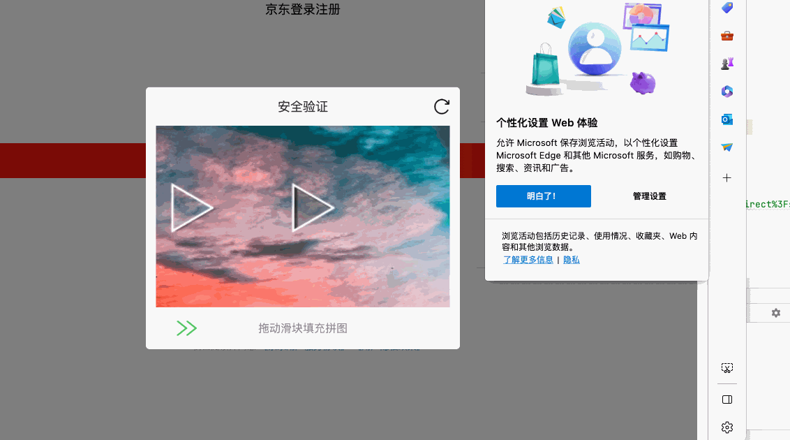

# 这是什么
通过手机号码和密码登录jd，返回cookie。

# 原理
使用图像方法识别出滑块位置，通过selenium模拟滑动滑块。

# 目的
该项目的目的是为了学习selenium框架，请勿用于非法用途。

# 展示
注释掉代码中的第17行，可以看到程序自动化的过程


# 使用方法
```bash
python login.py 130xxxxxxxx your_password
```
将返回下面形式的内容
```text
pt_key=*********************;pt_pin=********;
```

# 存在的问题
识别率较低，所以程序会多次尝试，直到获取到cookie为止，会存在时间较久的问题。